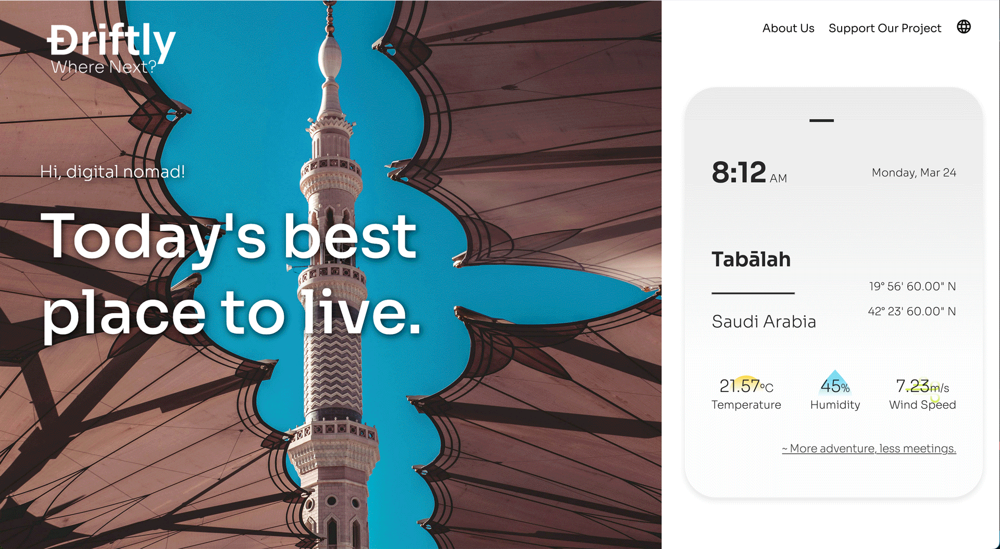

# DRIFTLY

Driftly is a web app that humorously suggests the best destinations for digital nomads depending on real-time weather conditions. By mimicking a travel agency, Driftly exaggerates the marketing discourse of digital nomad hubs. As a result, remote, or lesser-known places are recommended.

## 🛠️ Technologies Used

- **Frontend:** Vue.js
- **Backend:** Node.js, Express, Axios (API requests)
- **API:** OpenWeather (real-time weather updates)
- **Responsive Design:** Works across all devices

## 🎭 Visit Driftly [here](https://www.driftly.me)



https://www.driftly.me

## 🚀 Features

- Recommends a city based on current weather conditions
- Updates location data every 4 hours
- Responsive and mobile-friendly
- Built with Vue.js, Node.js, and Express
- Uses OpenWeather API for real-time weather data
- Randomized city selection for unexpected results
- Displays an image for each country of the shown destination

## 🛠 Installation & Setup

1. Clone this repository:
   ```sh
   git clone https://github.com/brizo-lab/driftly.git
   cd driftly
   ```
2. Backend Setup
   ```sh
   cd back
   npm install
   ```

   - Create a `.env` file in the back directory
   - Add your OpenWeather API key:
     ```
     OPENWEATHER_API_KEY=your_api_key_here
     ```
4. Start the backend:
   ```sh
   node server.js
   ```
5. Frontend Setup
   ```sh
   cd front
   npm install
   npm run serve
   ```

## 🎉 To deploy this project

   - Set up your backend server with a service like Heroku, AWS or Railway.

   - Make sure the API endpoint is publicly accessible.

   - Configure the URLs in the Vue.js code to point to the production server.

   - For the frontend, you can use platforms like Netlify or Vercel.

Don't forget to set the environment variables correctly in production.

## 🖼️ Image Credits

This repository doesn't include all country images due to the size of the folder. You can add your own images (named with the two-letter country code and .jpg) to the public/countries folder. Otherwise by default it will show the image window.jpg.

All images used in the project are sourced from [Unsplash](https://unsplash.com). Thanks to the photographers and platform for providing high-quality visuals for free.


